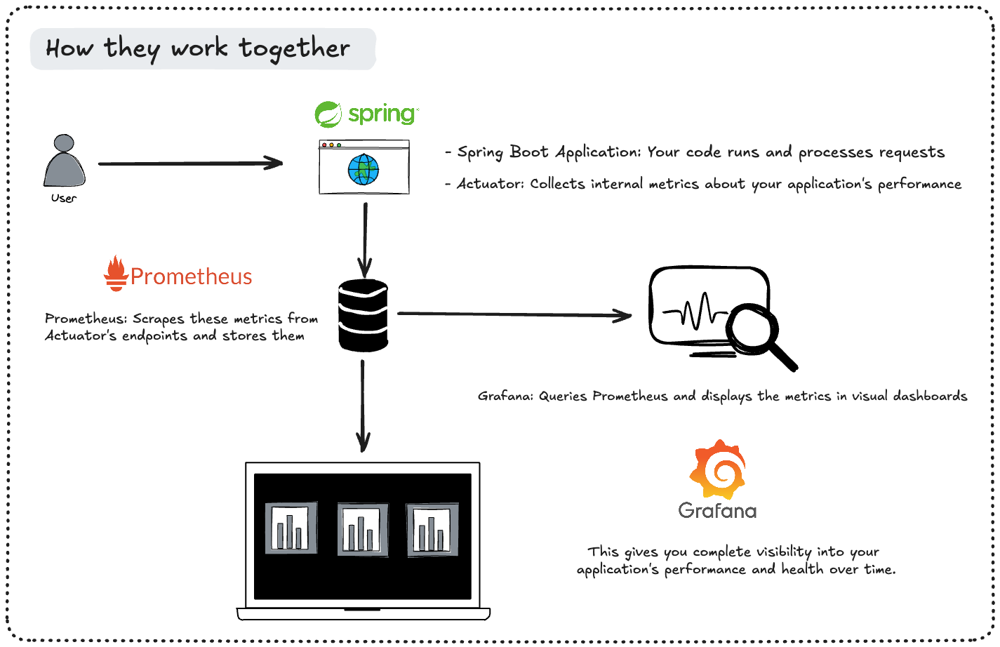

# Grafana Dashboard Tutorial for AI Applications

This simple tutorial demonstrates how to create a Grafana dashboard to monitor AI metrics from a Spring Boot application using Spring AI.

## Prerequisites

- Java 23
- Docker and Docker Compose
- OpenAI API key

## Project Structure

The project is organized as follows:
- `src/` - Spring Boot application source code
- `docker/` - Docker configuration files
  - `prometheus.yml` - Prometheus configuration for metrics collection
  - `grafana/dashboards/ai-metrics-dashboard.json` - Pre-configured Grafana dashboard for AI metrics visualization
  - `grafana/provisioning/dashboards/ai-metrics-dashboard.yml` - Automatic dashboard loading configuration
  - `grafana/provisioning/datasources/prometheus.yml` - Connects Grafana to Prometheus data source automatically





## Setup

1. Set your OpenAI API key as an environment variable:

```shell
export OPENAI_API_KEY=your-openai-api-key
```

2. Run the Spring Boot application using Maven:

```shell
./mvnw spring-boot:run
```

This will start:
- Spring Boot application on port 8080
- Prometheus on port 9090 (via Docker)
- Grafana on port 3000 (via Docker)

## Accessing the Application

- Spring Boot application: http://localhost:8080
- Prometheus: http://localhost:9090
- Grafana: http://localhost:3000 (login with admin/admin)

## Creating a Grafana Dashboard

1. **Log in to Grafana**
   - Open http://localhost:3000
   - Login with username: `admin` and password: `admin`
   - You can skip changing the password for this tutorial

2. **Prometheus Data Source**
   - This is automatically configured by the Docker setup
   - You can verify it at Configuration (gear icon) > Data Sources

3. **Using the Pre-configured Dashboard**
   - A dashboard is already configured and automatically loaded
   - Navigate to Dashboards > General to find "Spring AI Metrics Dashboard"
   - This dashboard includes panels for token usage, request counts, and response times

4. **Optional: Create Your Own Dashboard**
   - Click on "Dashboards" in the left sidebar
   - Click "New" > "New Dashboard"
   - Click "Add visualization"

5. **Add Token Usage Panel**
   - Select the Prometheus data source
   - Enter the following query:
     ```
     spring_ai_request_tokens_prompt_total
     ```
   - Add another query:
     ```
     spring_ai_response_tokens_completion_total
     ```
   - Set the panel title to "Token Usage"
   - Click "Apply"

6. **Add Total Requests Panel**
   - Click "Add panel"
   - Select "Stat" visualization
   - Enter the query:
     ```
     spring_ai_request_total
     ```
   - Set the panel title to "Total AI Requests"
   - Click "Apply"

7. **Add Response Time Panel**
   - Click "Add panel"
   - Select "Gauge" visualization
   - Enter the query:
     ```
     rate(spring_ai_request_duration_seconds_sum[1m]) / rate(spring_ai_request_duration_seconds_count[1m]) * 1000
     ```
   - Set the unit to "milliseconds"
   - Set the panel title to "Average Response Time"
   - Click "Apply"

8. **Save the Dashboard**
   - Click the save icon in the top right
   - Name your dashboard "Spring AI Metrics"
   - Click "Save"

## Testing the Dashboard

1. Send a http request to http://localhost:8080/api/chat with a prompt request parameter
2. Watch the metrics update in real-time on the Grafana dashboard

## Docker Configuration Files Explained

The `docker/` directory contains essential files for the monitoring infrastructure:

1. `prometheus.yml`: 
   - Configuration for Prometheus server
   - Defines scraping endpoints for Spring Boot application metrics
   - Sets scrape intervals and evaluation timeouts

2. `grafana/dashboards/ai-metrics-dashboard.json`: 
   - Pre-configured Grafana dashboard JSON definition
   - Contains visualizations for AI metrics (token usage, response times, error rates)
   - Will be automatically loaded into Grafana on startup

3. `grafana/provisioning/dashboards/ai-metrics-dashboard.yml`:
   - Grafana dashboard provisioning configuration
   - Tells Grafana where to find dashboard JSON files
   - Ensures dashboards are loaded automatically on startup

4. `grafana/provisioning/datasources/prometheus.yml`:
   - Grafana datasource configuration
   - Automatically configures Prometheus as a data source
   - No manual setup required in the Grafana UI

## Understanding the Metrics

Spring AI automatically tracks these key metrics:

- **Token Usage**:
  - `spring_ai_request_tokens_prompt_total`: Total prompt tokens sent to the AI
  - `spring_ai_response_tokens_completion_total`: Total completion tokens received from the AI

- **Request Metrics**:
  - `spring_ai_request_total`: Total number of AI requests
  - `spring_ai_request_duration_seconds`: Duration of AI requests

## Next Steps

- Add more panels to track other metrics
- Set up alerts for high token usage or slow response times
- Create a dashboard for multiple AI models